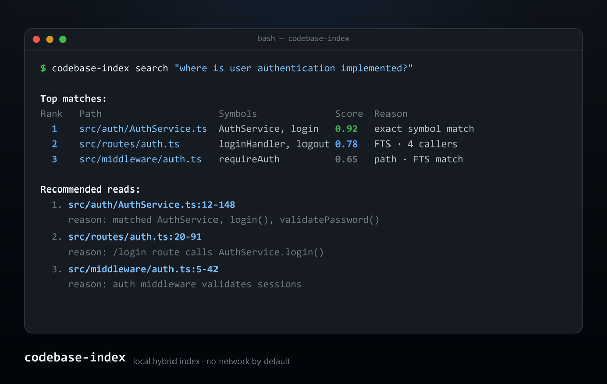

# codebase-index: Local Codebase Indexing for AI Coding Agents

`codebase-index` is a local-first codebase indexing tool that helps Claude Code,
Codex CLI, OpenCode, and other AI coding agents find relevant files, symbols, and
references without scanning an entire repository.

[](LICENSE)
[](https://www.python.org/)
[](https://github.com/denfry/codebase-index/actions)
[](skill/SKILL.md)
[](#which-ai-clis-does-codebase-index-support)
[](#which-ai-clis-does-codebase-index-support)
[](docs/MCP.md)
[](#safety-and-privacy)
[](#safety-and-privacy)
[](#safety-and-privacy)
[](docs/DATABASE_SCHEMA.md)
[](docs/ARCHITECTURE.md)

<p align="center">
  
</p>

## What Is codebase-index?

**codebase-index is a private, offline retrieval layer for AI code search.** It
builds a SQLite index of your repository, extracts symbols with Tree-sitter,
ranks matches with hybrid retrieval, and returns compact file:line ranges that
an AI coding agent can read instead of opening broad file sets.

Use it when you want Cursor-like codebase awareness in terminal-based AI tools
while keeping source code, snippets, and search metadata on your machine.

> **codebase-index is not an IDE and not a coding agent.** It is the local
> retrieval/index layer that gives terminal and MCP-based AI agents precise
> codebase context. The agent stays your interface; this gives it better aim.

## Who Is It For?

- **Claude Code / Codex CLI / OpenCode users** on medium-to-large repos who want
  the agent to read 3 ranked files instead of grepping and scanning 60.
- **Privacy-constrained teams** (proprietary or regulated code) who cannot send
  source to a cloud code-intelligence service.
- **MCP power users** who want a stable, queryable code index as a tool, not a
  black box baked into one agent's prompt.
- **Tooling authors** who need scriptable retrieval (`--json`, SQLite, MCP) that
  other tools can build on.

Not for you if you want a full IDE, org-scale multi-repo search, or a hosted
platform — use Cursor or Sourcegraph for those.

## Start Here

If you are opening this repository for the first time, follow this order:

1. [Quick Start (5 minutes)](docs/QUICKSTART.md)
2. [Installation Guide](docs/INSTALLATION.md)
3. [Benchmarks](docs/BENCHMARKS.md)
4. [How the skill works](skill/SKILL.md)
5. [MCP server](docs/MCP.md)
6. [FAQ](docs/FAQ.md)

If you only need the shortest path, run:

```bash
pip install "codebase-index @ git+https://github.com/denfry/codebase-index.git@v1.6.0"
cd your-project
codebase-index init            # prompts for Claude Code / Codex CLI / OpenCode
codebase-index index
codebase-index search "where is authentication implemented?"
```

## Project Status

**`1.6.0` is released.** The current release includes repository discovery,
SQLite FTS5 storage, Tree-sitter symbols and references, hybrid ranking, graph
impact analysis, token-budgeted retrieval packets, optional local embeddings,
hooks/watch support, multi-CLI installation, MCP server support, and a tested
GitHub-only `pipx` install path.

The `1.6.0` release turns the dependency graph into a navigable map: every edge
carries a `confidence` audit trail (`extracted`/`inferred`/`ambiguous`, surfaced
in `refs`/`impact`); a new zero-dependency analytics pass computes modules
(communities), god nodes, and surprising cross-module links, exposed via the
`architecture` command/MCP tool; `path` traces the shortest dependency chain
between two symbols and `describe` prints a symbol's node card; and the HTML
graph is coloured by module and sized by connectivity, with `--format
graphml|dot|neo4j` exports for external tools. Requires a one-time reindex
(schema 2 → 3).

The earlier `1.4.0` release hardened the MCP contract (a `schema_version` +
`tool` envelope on every payload, golden-locked per tool, plus a fix so the
server loads on current `mcp`/`pydantic`), dampened the god-class `in_degree`
rerank tiebreak (logarithmic, validated no-regression on the public benchmark),
and labelled config/IaC files (Dockerfile, Terraform, HCL, INI, Makefiles) so
infra surfaces in `stats` and search.

The earlier `1.3.0` release added a content-addressed embedding cache (rebuilds reuse
vectors for unchanged content), a batched graph build (7–28× faster edge
resolution plus a new `edges(file_id)` index), a shared CLI/MCP service layer
(MCP hybrid search now uses the vector channel; `index_stats` reports the
per-language graph tier), graph-coverage signals in `stats`/`refs`/`impact`,
CLI pagination via `search --offset`, and single-source versioning with a CI
gate that keeps every committed skill copy in sync.
The `1.2.1` release added skill auto-update/rollback commands and version
stamps so installed skills stay in sync with the package automatically.
See [CHANGELOG.md](CHANGELOG.md) and
[docs/ROADMAP.md](docs/ROADMAP.md).

MCP is now available as a stdio server via `codebase-index mcp --root <repo>`.
It exposes `healthcheck`, `search_code`, `find_symbol`, `find_refs`,
`impact_of`, `explain_code`, `architecture_overview`, `path_between`,
`describe_symbol`, and `index_stats`; see [docs/MCP.md](docs/MCP.md).

```
You:   "Where is user authentication implemented?"
Agent: searches local index (symbols + FTS5 + graph)
       reads only 3 ranked files instead of scanning 60
       answers with citations: src/auth/AuthService.ts:12-148
```

---

## How Do I Install codebase-index?

For most users, install the package from the tagged GitHub release and run
`init` inside the repository you want to index:

```bash
pip install "codebase-index @ git+https://github.com/denfry/codebase-index.git@v1.6.0"
cd your-project
codebase-index init            # choose Claude Code, Codex CLI, OpenCode, or all
codebase-index index
```

In a non-interactive script, pass a target explicitly:

```bash
codebase-index init --target auto      # install into detected AI CLIs
codebase-index init --target codex     # write AGENTS.md + Codex resources
codebase-index init --target claude    # write .claude/skills/codebase-index
codebase-index init --target opencode  # write OpenCode command + agent files
```

### Install as a Claude Code plugin

One command in Claude Code:

```
/plugin marketplace add denfry/codebase-index
/plugin install codebase-index@codebase-index
```

Or just ask: "install the codebase-index plugin".

**What happens on first run:** when a session starts, a `SessionStart` hook
(`scripts/bootstrap.sh` / `.ps1`) creates a private Python virtual environment under
`~/.claude/plugins/data/codebase-index-*/venv` and installs the pinned
`codebase-index` package (from `requirements.lock`) into it — using `uv` if present,
otherwise `python -m venv` + `pip`. It reinstalls only when the lock file changes.
Nothing is installed globally; uninstalling the plugin removes the data directory.

**Prerequisite:** Python 3.11+ on your PATH. The first install needs network access to
fetch the package; later sessions are offline. The skill builds its index on
your first codebase question, so there is no manual `index` step.

**Distribution note:** the plugin bootstrap installs the pinned requirement from
`requirements.lock`. In `1.6.0`, that lock points at the tagged GitHub release
instead of PyPI. You can override it with `CBX_INSTALL_SPEC` when testing a local
checkout or a different Git ref.

## What Problem Does codebase-index Solve?

AI coding agents struggle with large repositories when they rely on broad file
reads, grep output, or user-provided context. `codebase-index` gives those agents
a ranked local retrieval packet before they read source files.

- **Token waste** — Scanning entire files or running broad grep/glob queries burns through the context window on irrelevant content.
- **No symbol awareness** — Standard search can't distinguish a function definition from a call, or a class from a variable.
- **No ranking** — Grep returns all matches with no relevance ordering. The agent must read everything.
- **No context** — Grep doesn't know which files are related or what to read next.
- **Cloud dependency** — External code indexing services send your proprietary code to remote servers.

Developers get Cursor-like codebase awareness in Claude Code, Codex CLI, and
OpenCode without leaving the terminal or sending code to a remote indexing
service.

## How Is This Different?

Short answers to the questions people actually ask. The full, honest matrix —
including when you should pick the other tool — is in
[docs/COMPARISON.md](docs/COMPARISON.md).

- **Why not just `grep`/`rg`?** Grep returns every match with no ranking, no
  symbol awareness, and no idea which files relate. codebase-index ranks results,
  knows a definition from a call, expands along the dependency graph, and returns
  specific line ranges under a token budget — so the agent reads less and answers
  with citations.
- **Why not Cursor?** Cursor is a great AI IDE with strong codebase awareness, but
  it is proprietary and IDE-centric. codebase-index is a local, open retrieval
  layer for **terminal and MCP** agents, offline by default, with no IDE lock-in.
  If you live inside Cursor, keep using Cursor.
- **Why not Aider repo-map?** Aider's repo-map is a good graph-ranked,
  token-budgeted context map — but it is optimized to feed Aider's own chat.
  codebase-index is a **reusable, queryable index**: CLI/JSON/MCP commands return
  ranked `file:line` ranges, symbols, references, and impact that *any*
  shell-capable agent can consume, with freshness and security gates.
- **Why not Sourcegraph / Cody / Amp?** They are excellent enterprise-grade,
  cross-repo code intelligence platforms. They are also heavier and
  account/platform-oriented. codebase-index is single-repo, local, and
  lightweight — no server, no account, no code leaving the machine by default.
- **Why not Codebase-Memory MCP?** It is the closest direct alternative — a
  broader graph engine with a static binary and wide language/agent coverage. We
  do **not** claim to beat it globally. We differentiate on simplicity, a strict
  privacy model, token-budgeted retrieval packets, a transparent Python
  implementation, the Claude/Codex/OpenCode workflow, and honest benchmarks. If
  you need its broader graph and language reach today, choose it.

**What makes it trustworthy?** No telemetry, no network by default, a multi-gate
exclusion pipeline (secrets/binaries/generated/dependencies never indexed),
output-time secret redaction, a `doctor --strict` safety self-check, and a
public benchmark suite wired as a CI regression gate. Claims that aren't proven
in this repo are marked as roadmap, not done.

### Proven today vs. roadmap

| Capability | Status |
|---|---|
| Hybrid retrieval (path + symbol + FTS5 + graph), token-budgeted packets | ✅ Shipped |
| Tree-sitter symbols for 12 Tier-A languages + Tier-B generic path | ✅ Shipped |
| Import/call/reference/inheritance graph, `refs`/`impact` | ✅ Shipped |
| Optional local embeddings; external embeddings gated 3 ways | ✅ Shipped |
| stdio MCP server; CLI/skill/MCP share one service layer | ✅ Shipped |
| Honest 55k LOC Java benchmark (recall@3 70% vs 40% `rg`, ~13× fewer tokens) | ✅ Shipped |
| 10k/100k/1M LOC public-repo benchmarks | 🚧 Roadmap |
| Framework-aware typed edges (route→handler→service→model) | 🚧 Roadmap |
| PyPI / `uvx` / Homebrew, signed checksums, SBOM | 🚧 Roadmap |
| Verified per-client MCP docs, paged/progressive results | 🚧 Roadmap |

See [docs/PRODUCT_UPGRADE_PLAN.md](docs/PRODUCT_UPGRADE_PLAN.md) for the full
upgrade plan and ranked roadmap.

## How Does codebase-index Work?

`codebase-index` builds a local hybrid index that combines:

- **Symbol search** — Tree-sitter AST parsing extracts classes, functions, methods, and variables across the supported code-language set.
- **Full-text search** — SQLite FTS5 for fast lexical search across code chunks.
- **Path search** — File path matching for location-aware queries.
- **Optional semantic search** — Vector embeddings for similarity-based retrieval (opt-in, local by default).
- **Dependency graph** — Import, call, and reference edges for impact analysis and graph expansion.
- **Token-budgeted output** — Ranked retrieval packets with specific line ranges, not whole files.

The AI agent reads only the recommended files and line ranges, not the entire
repository.

## Quick Demo

```bash
/codebase-index "where is user authentication implemented?"
```

Expected output:

```
Top matches:
┌──────┬──────────────────────────┬──────────────────────────┬───────┬──────────────────────────────┐
│ Rank │ Path                     │ Symbols                  │ Score │ Reason                       │
├──────┼──────────────────────────┼──────────────────────────┼───────┼──────────────────────────────┤
│    1 │ src/auth/AuthService.ts  │ AuthService, login       │  0.92 │ exact symbol match           │
│    2 │ src/routes/auth.ts       │ loginHandler, logout     │  0.78 │ FTS match · 4 callers        │
│    3 │ src/middleware/auth.ts   │ requireAuth              │  0.65 │ path match · FTS match       │
└──────┴──────────────────────────┴──────────────────────────┴───────┴──────────────────────────────┘

Recommended reads:
  1. src/auth/AuthService.ts:12-148
     reason: matched AuthService, login(), validatePassword()
  2. src/routes/auth.ts:20-91
     reason: /login route calls AuthService.login()
  3. src/middleware/auth.ts:5-42
     reason: auth middleware validates sessions
```

## Installation Options

If you are new to this repo, start with [docs/QUICKSTART.md](docs/QUICKSTART.md).  
If you want all install options and troubleshooting, use [docs/INSTALLATION.md](docs/INSTALLATION.md).

**Multi-CLI installer (Claude Code + Codex CLI + OpenCode):** one command via
`install.sh` / `install.ps1` — see [docs/installer.md](docs/installer.md).

```bash
# macOS / Linux
curl -fsSL https://raw.githubusercontent.com/denfry/codebase-index/main/install.sh | sh
```
```powershell
# Windows PowerShell
irm https://raw.githubusercontent.com/denfry/codebase-index/main/install.ps1 | iex
```

### Option 1: Install from a tagged GitHub release

```bash
cd your-project
pip install "codebase-index @ git+https://github.com/denfry/codebase-index.git@v1.6.0"
codebase-index init
codebase-index index
```

### Python version compatibility

`codebase-index` requires Python 3.11 or newer.

If `codebase-index init --target opencode` fails with:

```text
ModuleNotFoundError: No module named 'importlib.resources.abc'; 'importlib.resources' is not a package
```

the `pipx` environment was likely created with an older Python version. Reinstall `codebase-index` using Python 3.11+ explicitly:

```powershell
pipx uninstall codebase-index
py -0p
pipx install --python "<path-to-python-3.11-or-newer>\python.exe" "git+https://github.com/denfry/codebase-index.git@v1.6.0"
```

For example:

```powershell
pipx install --python "C:\Users\you\AppData\Local\Programs\Python\Python312\python.exe" "git+https://github.com/denfry/codebase-index.git@v1.6.0"
```

Then run initialization again:

```powershell
codebase-index init --target opencode
codebase-index index
```


### Option 2: Install with pipx from GitHub

```bash
pipx install "git+https://github.com/denfry/codebase-index.git@v1.6.0"
cd your-project
codebase-index init --target auto
codebase-index index
```

### Option 3: Install from source

```bash
git clone https://github.com/denfry/codebase-index.git
cd codebase-index
pip install -e ".[dev]"
```

### Distribution roadmap

PyPI, `uvx`, Homebrew, signed release checksums, and SBOMs are important for a
tool that reads entire repositories, but they are not all verified as shipped in
`1.6.0`. Target install story:

```bash
uvx codebase-index init
pipx install codebase-index
brew install denfry/tap/codebase-index
```

### Verify the install

```bash
codebase-index doctor
```

See [docs/INSTALLATION.md](docs/INSTALLATION.md) for the full guide, including optional extras (embeddings, watch mode) and troubleshooting.

## Usage

```bash
# Initialize the index for your project
codebase-index init

# Build the index
codebase-index index

# Search for something
codebase-index search "where is authentication implemented?"

# Look up a specific symbol
codebase-index symbol "AuthService"

# Find callers and references
codebase-index refs "AuthService.login"

# Analyze impact of a change
codebase-index impact "src/auth/AuthService.ts"

# Map the codebase: modules, god nodes, surprising links, suggested questions
codebase-index architecture

# How are two symbols/files connected? Shortest dependency/call path
codebase-index path "renew" "refresh_access_token"

# Node card: definition, callers, callees, centrality, module
codebase-index describe "Database"

# Visualize the graph (modules coloured, size = connectivity, edge style = confidence)
codebase-index graph --open
# …or export for external tools: graphml (Gephi/yEd), dot (Graphviz), neo4j (Cypher)
codebase-index graph --format graphml -o graph.graphml

# View index statistics
codebase-index stats

# Run diagnostics
codebase-index doctor
```

Add `--json` to any command for machine-readable output.

## How Does Retrieval Flow Through codebase-index?

```
User question
    ↓
CLI instructions or skill
    ↓
Hybrid retrieval
    ├─ Path search
    ├─ Symbol search (Tree-sitter AST)
    ├─ SQLite FTS5 full-text search
    ├─ Optional embeddings (vector search)
    └─ Graph expansion (callers, imports, references)
    ↓
Ranked retrieval packet
    ↓
Agent reads only the recommended line ranges
    ↓
Answer with precise file:line citations
```

## Features

- [x] **Local-first indexing** — All data stays on your machine
- [x] **No network by default** — Zero external API calls out of the box
- [x] **Respects ignore files** — `.gitignore`, `.claudeignore`, `.codeindexignore`
- [x] **SQLite storage** — Fast, reliable, single-file database
- [x] **FTS5 lexical search** — Full-text search with code-aware tokenization
- [x] **Tree-sitter AST parsing** — Tier-A symbol extraction for Python, JavaScript, TypeScript, Java, Go, Rust, C, C++, C#, Ruby, PHP, and Kotlin; Tier-B generic extraction for code languages with a loadable grammar such as Lua
- [x] **Symbol extraction** — Classes, functions, methods, variables with line ranges
- [x] **Incremental indexing** — Only changed files are re-indexed
- [x] **Token-budgeted output** — Configurable max output size
- [x] **Secret redaction** — Masks keys, tokens, and credentials in snippets
- [x] **Optional embeddings** — Local or remote vector search (opt-in)
- [x] **Optional hooks/watch** — Auto-update index after file edits
- [x] **Multi-CLI setup** — Claude Code, Codex CLI, and OpenCode instructions
- [x] **MCP server** — stdio MCP tools for search, symbols, refs, impact, explain, health, and stats

## Safety and Privacy

> **Trust model in 60 seconds**
> 1. **Offline by default** — the base install has zero network dependencies; nothing leaves your machine.
> 2. **One opt-in exit, triple-gated** — external embeddings require `allow_external` **and** an env API key **and** a printed endpoint warning, or they are refused.
> 3. **Secrets never get in** — `.env`, keys, certs, and credential files are excluded before parsing (multi-gate ignore pipeline).
> 4. **Secrets never get out** — every snippet is redacted (AWS keys, private keys, JWTs, bearer tokens, connection strings) before it reaches the agent.
> 5. **No telemetry, ever** — no analytics, no phone-home, no usage data.
> 6. **Verify it yourself** — `codebase-index doctor --strict` audits all of the above and exits non-zero in CI on any high-severity finding.

`codebase-index` is designed with privacy as a first principle:

- **No telemetry** — No usage data, analytics, or crash reports are collected or transmitted.
- **No external API calls by default** — All indexing, storage, and search happen locally.
- **Does not index sensitive files** — `.env`, private keys, certificates, tokens, and credential files are excluded before parsing.
- **Respects ignore files** — `.gitignore`, `.claudeignore`, `.codeindexignore`, and `.cursorignore` are all honored.
- **Index stored locally** — SQLite database in `.claude/cache/codebase-index/` (gitignored by default).
- **Optional embeddings are local by default** — External embedding APIs require explicit opt-in with warnings.
- **Secret redaction** — Snippets are scrubbed for AWS keys, private keys, JWTs, bearer tokens, and connection strings before output.

See [docs/SECURITY_MODEL.md](docs/SECURITY_MODEL.md) for the full security model and threat analysis.


## Benchmark Results

There are three benchmark surfaces today:

1. **Public benchmark suite** in `tests/benchmark_public.py`: reproducible
   multi-language fixture with Recall@1/3/5, MRR, nDCG, answer-correctness proxy,
   token economy, language breakdown, freshness latency, graph tasks, and scale counters.
2. **Smoke benchmark** on `sample_repo`: validates the CLI is fast and stable on
   a tiny fixture, but it is not evidence of production retrieval quality.
3. **Honest benchmark** on a real Java repository: `tests/benchmark_honest.py`
   compares codebase-index against a disciplined `rg` + read-window baseline on
   10 realistic questions. Results are documented in
   [tests/benchmark_honest_RESULTS.md](tests/benchmark_honest_RESULTS.md).

Run the public suite:

```bash
python tests/benchmark_public.py --workdir .tmp-public-benchmark
```

Current honest benchmark headline:

| Metric | Result |
|---|---|
| Repo | 303 Java files, ~55k LOC |
| Retrieval quality | recall@3: 70% index vs 40% `rg` baseline |
| Token economy | ~13x fewer answer tokens than `rg` + 80-line windows |
| Verified language impact | Java symbols fixed from 0 to 3,543 symbols |

The public suite now has the metric framework. It still needs larger public or
documented external repos for 10k/100k/1M LOC scale claims and deeper framework
graph tasks. See [docs/BENCHMARKS.md](docs/BENCHMARKS.md).

## Repository Layout

```
├── skill/              # Source instruction package (SKILL.md, scripts, examples)
├── skills/             # Plugin skill copy
├── src/codebase_index/ # Python package (CLI, indexer, retrieval, storage)
├── docs/               # Documentation (architecture, schema, security, FAQ)
├── examples/           # Sample queries, retrieval output, demo project
├── tests/              # Test suite with fixture repositories
├── bin/                # Plugin CLI wrappers (cbx, codebase-index)
├── scripts/            # Bootstrap scripts (bootstrap.sh, bootstrap.ps1)
├── hooks/              # Plugin hooks (hooks.json)
├── .claude-plugin/     # Plugin manifest + marketplace catalog
├── .github/            # Issue templates, CI workflows, PR template
├── README.md           # This file
├── LICENSE             # MIT License
├── CHANGELOG.md        # Release history
├── CONTRIBUTING.md     # Contributor guide
├── SECURITY.md         # Security policy
├── ROADMAP.md          # Development milestones
├── requirements.lock   # Pinned install spec for bootstrap
└── pyproject.toml      # Package configuration
```

## Configuration

Create `.codeindex.json` in your project root:

```json
{
  "index": {
    "max_file_bytes": 1048576,
    "chunk_size": 500,
    "chunk_overlap": 50
  },
  "embeddings": {
    "backend": "noop",
    "allow_external": false
  }
}
```

### Ignore Files

- `.codeindexignore` — Tool-specific ignore patterns (highest priority)
- `.gitignore` — Standard git ignore patterns
- `.claudeignore` — Claude-specific ignore patterns

### Cache Location

```
.claude/cache/codebase-index/
├── index.sqlite   # SQLite database with FTS5
└── config.json    # Resolved configuration
```

## Which AI CLIs Does codebase-index Support?

`codebase-index init` can install instructions for three AI coding CLIs:

| CLI | Files written by `init` | Best command |
|---|---|---|
| Claude Code | `.claude/skills/codebase-index/` | `codebase-index init --target claude` |
| Codex CLI | `AGENTS.md` + `.codex/skills/codebase-index/` | `codebase-index init --target codex` |
| OpenCode | `.opencode/commands/` + `.opencode/agents/` + resources | `codebase-index init --target opencode` |

Use `codebase-index init --target auto` to install into detected CLIs, or
`codebase-index init --target all` to write every supported integration.

### Claude Code Integration

The Claude Code skill is defined in [`skill/SKILL.md`](skill/SKILL.md) with
YAML frontmatter for automatic selection.

Example `.claude/CLAUDE.md`:

```markdown
## Codebase Questions

Before answering any question about this project's code:
1. Use the codebase-index skill to search the local index first.
2. Read only the recommended line ranges — do not scan entire files.
3. Answer with file:line citations.
```

### Optional Hooks

Configure automatic index updates in `.codeindex.json`:

```json
{
  "hooks": {
    "post_tool_use": {
      "enabled": true,
      "events": ["Write", "Edit"],
      "command": "codebase-index update --quiet"
    }
  }
}
```

See [skill/examples/](skill/examples/) for full examples.

## FAQ

### Is this a Cursor replacement?

No. `codebase-index` is not a replacement for Cursor or any IDE. It is a
local retrieval layer for terminal AI coding agents. You still use Claude Code,
Codex CLI, OpenCode, or another agent as your primary interface.

### Does it send my code anywhere?

No. By default, `codebase-index` is completely local-first and offline. All indexing, storage, and search happen on your machine. External embeddings are opt-in only and require explicit configuration.

### Does it work without embeddings?

Yes. The default configuration disables embeddings entirely (`backend = "noop"`). Search uses SQLite FTS5, Tree-sitter symbol extraction, path matching, and graph expansion. Embeddings are an optional enhancement.

### Does it support large repositories?

Yes. The index is incremental — only changed files are re-indexed. SQLite with FTS5 handles large datasets efficiently. Generated files, dependencies, and binaries are excluded automatically.

### Why not just use Grep?

Grep returns all matches with no ranking, no symbol awareness, and no context about related files. `codebase-index` combines lexical search with symbol extraction and graph expansion to return **ranked, contextual results** with specific line ranges to read.

### Does it support MCP?

Yes. Run `codebase-index mcp --root <repo>` to expose the local index over stdio
MCP. See [docs/MCP.md](docs/MCP.md) for tools and client config templates.

### Can I use it with other agents?

Yes. The CLI is agent-agnostic. Any agent that can run shell commands can use
`codebase-index`, and JSON output (`--json`) is parseable by other tools.

### How do I reset the index?

```bash
codebase-index clean          # reset the index DB (keeps the skill)
codebase-index clean --all    # wipe the whole .claude/cache/codebase-index/ dir
# Or manually: rm -rf .claude/cache/codebase-index/
codebase-index index
```

## Contributing

We welcome contributions! See [CONTRIBUTING.md](CONTRIBUTING.md) for the full guide.

Quick start:

```bash
git clone https://github.com/denfry/codebase-index.git
cd codebase-index
pip install -e ".[dev]"
pytest
ruff check src/ tests/
```

## Roadmap

See [ROADMAP.md](ROADMAP.md) for the full milestone plan.

| Milestone | Status | Description |
|---|---|---|
| M0 | ✅ Done | Repository packaging |
| M1 | ✅ Done | SQLite + FTS5 index |
| M2 | ✅ Done | Tree-sitter symbol extraction |
| M3 | ✅ Done | Hybrid retrieval |
| M4 | ✅ Done | Graph expansion |
| M5 | ✅ Done | Token-budgeted retrieval packets |
| M6 | ✅ Done | Optional local embeddings |
| M7 | ✅ Done | Claude Code Skill packaging |
| M7.5 | ✅ Done | One-command plugin install |
| M8 | ✅ Done | Hooks + watch mode |
| M9 | ✅ Done | Public release |

## License

[MIT](LICENSE)
