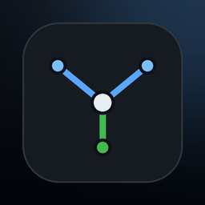
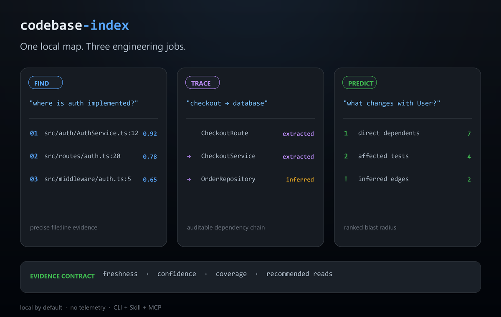

<p align="center">
  
</p>

<h1 align="center">codebase-index</h1>

<p align="center">
  <strong>Give AI coding agents a precise map of your codebase — locally,
  privately, and with evidence.</strong>
</p>

<p align="center">
  Find implementations. Trace behavior. Predict change impact.
</p>

<p align="center">
  <a href="docs/QUICKSTART.md">Quick start</a> ·
  <a href="docs/INSTALLATION.md">Install</a> ·
  <a href="docs/BENCHMARKS.md">Benchmarks</a> ·
  <a href="docs/SECURITY.md">Security</a> ·
  <a href="docs/MCP.md">MCP</a>
</p>

<p align="center">
  <a href="https://pypi.org/project/codebase-index/"></a>
  <a href="https://github.com/denfry/codebase-index/actions"></a>
  
  
  
  <a href="LICENSE"></a>
</p>

<p align="center">
  
</p>

## The short version

`codebase-index` is a local retrieval and code-graph layer for Claude Code,
Codex CLI, OpenCode, and MCP clients. It indexes a repository into SQLite,
extracts symbols and relationships with Tree-sitter, and gives agents ranked
`file:line` evidence instead of making them scan broad sets of files.

```text
Question → ranked retrieval → dependency evidence → precise answer
```

It is not an IDE and not another coding agent. Your existing agent remains the
interface; `codebase-index` gives it better aim.

## Find. Trace. Predict.

| Job | Question | Command |
|---|---|---|
| **Find** | Where is authentication implemented? | `codebase-index search "authentication"` |
| **Trace** | How does checkout reach the database? | `codebase-index explain "checkout flow"` |
| **Trace** | How are two components connected? | `codebase-index path ApiController Database` |
| **Predict** | What breaks if `User` changes? | `codebase-index impact User` |
| **Predict** | What does my current diff affect? | `codebase-index diff-impact` |

Every retrieval packet carries:

- ranked matches and the reason each match scored;
- exact line ranges to read next;
- index freshness;
- answer confidence and targeted fallbacks;
- graph coverage and edge confidence where relevant.

That evidence contract lets an agent distinguish “nothing references this” from
“the graph is partial, so verify with a targeted search.”

## Install in five minutes

```bash
pip install codebase-index
cd your-project
codebase-index init
codebase-index index
codebase-index search "where is authentication implemented?"
```

`init` can install resources for Claude Code, Codex CLI, OpenCode, and detected
MCP clients:

```bash
codebase-index init --target auto
codebase-index init --target codex
codebase-index init --target claude
codebase-index init --target opencode
```

`pipx install codebase-index` is supported as an isolated alternative. See the
[installation guide](docs/INSTALLATION.md) for pinned releases, editable
installs, hooks, Windows details, and troubleshooting.

### Claude Code plugin

```text
/plugin marketplace add denfry/codebase-index
/plugin install codebase-index@codebase-index
```

The plugin provisions a private environment on first use. Later sessions run
offline, and the first codebase question builds the index automatically.

## What the agent receives

```json
{
  "query": "where is authentication implemented?",
  "confidence": "high",
  "results": [
    {
      "path": "src/auth/AuthService.ts",
      "line_start": 12,
      "line_end": 148,
      "score": 0.92,
      "reason": "exact symbol match, 4 callers"
    }
  ],
  "recommended_reads": [
    {
      "path": "src/auth/AuthService.ts",
      "line_start": 12,
      "line_end": 148
    }
  ],
  "index": {
    "exists": true,
    "stale": false
  }
}
```

Snippets are skeletonized when that preserves evidence while saving tokens.
Unrelated bodies collapse, but imports, signatures, matched lines, and exact
read ranges remain.

## Core commands

```bash
# Find
codebase-index search "auth token refresh"
codebase-index symbol AuthService

# Trace
codebase-index explain "authentication flow"
codebase-index refs send_email
codebase-index path ApiController Database
codebase-index describe Database
codebase-index architecture

# Predict
codebase-index impact User --direction up --depth 2
codebase-index diff-impact --base HEAD --direction up --depth 2

# Inspect and visualize
codebase-index graph User --direction both --depth 2 --output graph.html
codebase-index stats
codebase-index doctor
```

Add `--json` for agents and automation. Search supports `hybrid`, `fts`,
`symbol`, and opt-in `vector` modes.

## Why not just grep?

Grep is excellent when you know the exact text. Repository questions often
need more:

| Capability | `rg` / grep | codebase-index |
|---|---:|---:|
| Exact text matching | Yes | Yes |
| Ranked results | No | Yes |
| Symbol definitions vs calls | No | Yes |
| Dependency and impact graph | No | Yes |
| Token-budgeted read plan | No | Yes |
| Freshness and coverage signals | No | Yes |
| Local and scriptable | Yes | Yes |

Use grep for one known string. Use `codebase-index` when the agent must locate,
understand, or assess a change across a repository.

The [comparison guide](docs/COMPARISON.md) also covers Cursor, Aider repo-map,
Sourcegraph, Continue, Amp, and Codebase-Memory MCP—including when those tools
are the better choice.

## Measured results

On the published 55k LOC Java benchmark:

- Recall@3: **70%** for `codebase-index` versus **40%** for the `rg` baseline;
- answer-context tokens: approximately **13× fewer**;
- raw results and methodology are checked into the repository.

These results are evidence for that benchmark, not a claim of universal
superiority. Large public-repository and framework-graph evaluations remain on
the [roadmap](docs/ROADMAP.md). Read the complete methodology and limitations in
[BENCHMARKS.md](docs/BENCHMARKS.md).

## Local by default

The base install:

- makes no network requests;
- sends no telemetry;
- stores the derived index inside the project cache;
- excludes dependency, build, binary, oversized, generated, and secret-like
  files before indexing;
- redacts secret patterns again at output time;
- exposes `doctor --strict` for CI and security checks.

Embeddings are optional. Local embeddings stay on the machine; external
embeddings require explicit configuration, an API key, and an endpoint
acknowledgement.

See the [security model](docs/SECURITY_MODEL.md) for trust boundaries, gates,
failure modes, and residual risks.

## How it works

```text
Repository
   │
   ├─ discovery + ignore and secret gates
   ├─ Tree-sitter symbols and relationships
   ├─ line and symbol-aligned chunks
   └─ optional embeddings
          │
          ▼
      local SQLite
   FTS5 + symbols + graph
          │
          ▼
 intent routing → hybrid retrieval → rerank → token budget
          │
          ▼
 ranked file:line evidence for CLI, Skill, and MCP
```

The three product surfaces share one service layer, so retrieval behavior does
not drift between the CLI, installed agent skills, and MCP tools.

Detailed internals:

- [Architecture](docs/ARCHITECTURE.md)
- [Retrieval pipeline](docs/RETRIEVAL_PIPELINE.md)
- [Database schema](docs/DATABASE_SCHEMA.md)
- [Language and graph coverage](docs/LANGUAGES.md)

## Supported surfaces

| Surface | Integration |
|---|---|
| Claude Code | Skill, plugin, optional hooks |
| Codex CLI | `AGENTS.md` plus project skill |
| OpenCode | Command, agent, and skill resources |
| MCP clients | stdio server with versioned JSON envelopes |
| Shell and automation | CLI, `--json`, and local SQLite |

Run the MCP server with:

```bash
codebase-index mcp --root /path/to/repository
```

Available MCP tools include search, explain, symbols, references, impact,
diff impact, architecture, shortest path, node description, health, and index statistics.
See [MCP.md](docs/MCP.md) for client configuration.

## Project status

The latest released line is **1.7.0**. It includes:

- hybrid and optional vector retrieval;
- Tree-sitter symbol extraction across the documented language tiers;
- import, call, reference, and inheritance graphs;
- architecture communities, central nodes, and surprising cross-module links;
- shortest dependency paths and node descriptions;
- token-budgeted and skeletonized retrieval packets;
- CLI, Skill, plugin, and MCP delivery;
- incremental updates, watch hooks, diagnostics, skill rollback, and diff-aware
  impact analysis.

Planned work is deliberately separated from shipped capability. The next
product priorities are stronger real-repository evaluations, typed framework
edges, and an even more direct task-context workflow. See the
[roadmap](docs/ROADMAP.md).

## Documentation

| Start here | Deep dives | Project trust |
|---|---|---|
| [Quick start](docs/QUICKSTART.md) | [Retrieval](docs/RETRIEVAL.md) | [Benchmarks](docs/BENCHMARKS.md) |
| [Installation](docs/INSTALLATION.md) | [Architecture](docs/ARCHITECTURE.md) | [Security](docs/SECURITY.md) |
| [FAQ](docs/FAQ.md) | [MCP](docs/MCP.md) | [Release checklist](docs/RELEASE_CHECKLIST.md) |
| [Skill design](docs/SKILL_DESIGN.md) | [Schema](docs/SCHEMA.md) | [Changelog](CHANGELOG.md) |

## Contributing

Contributions should preserve three invariants:

1. retrieval quality is measured, not asserted;
2. the default path remains local and fails closed at security boundaries;
3. machine-readable contracts stay stable across CLI and MCP.

Before opening a pull request:

```bash
pytest
ruff check .
mypy src
python scripts/sync_skill_copies.py --check
```

Add user-visible changes under `[Unreleased]` in [CHANGELOG.md](CHANGELOG.md).
See [CONTRIBUTING.md](CONTRIBUTING.md) if present and the repository
instructions for branch and review policy.

## License

[MIT](LICENSE)
