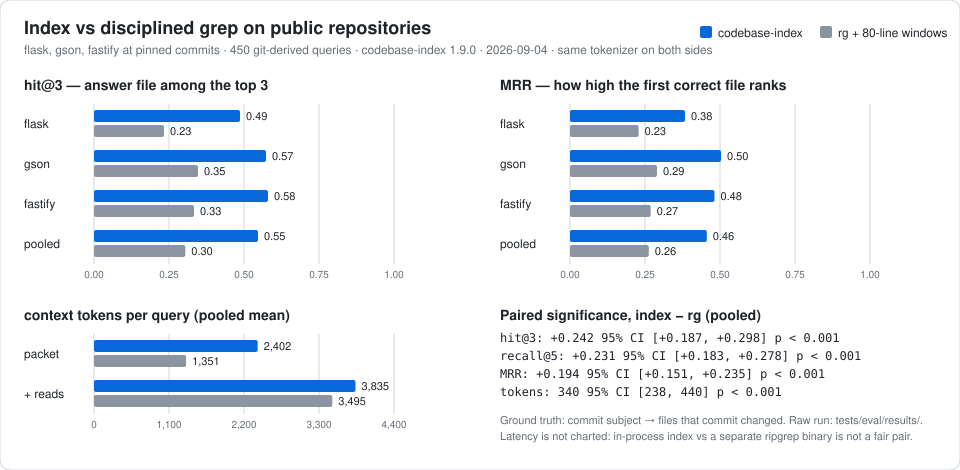

# Benchmarks

The rule of this project is *measure improvements, don't assert them*. This page
lists every benchmark surface, what it can and cannot prove, and the exact
numbers we are willing to put in a README. Anything not on this page is not a
claim.

## The one-paragraph version

On three public repositories at pinned commits (Flask, Gson, Fastify: Python,
Java, JavaScript), across 450 questions mined from git history, `codebase-index`
put the right file in its top three **55% of the time versus 30% for a
disciplined ripgrep agent**, at roughly the same context cost (3.8k vs 3.5k
tokens per question, same tokenizer on both sides). Every metric delta is
significant at p < 0.001 with paired bootstrap confidence intervals. Raw run:
[tests/eval/results/2026-09-04-public-baselines.md](../tests/eval/results/2026-09-04-public-baselines.md).
Reproduce it with one command (below). That is the headline; the rest of this
page is the fine print.

## Surfaces

| Surface | What it measures | Status | Use it as |
|---|---|---|---|
| **Public baselines** (`tests/eval/run_baselines.py`) | Index vs `rg`+window and vs repo-map-style context on public repos, symmetric tokens, significance | **Proven, reproducible** | The headline comparison against *not having an index* |
| **Retrieval eval** (`tests/eval/run_eval.py`) | Ranking quality of the shipped default vs the 1.7.0 baseline and one-signal ablations, pooled across corpora, with significance | **Proven (relative)** | The gate every ranking change must pass; measures deltas between versions, not superiority over other tools |
| Public synthetic suite (`tests/benchmark_public.py`) | Full metric framework on a deterministic toy fixture | Toy | CI regression gate for metric *shape*; not product evidence |
| Smoke/perf (`test_perf_smoke.py`, `test_benchmark_comparison.py`) | Latency and output-size guards on a tiny fixture | Toy | Regression checks only |
| Single-repo honest run (`tests/benchmark_honest.py`) | recall@3 and tokens vs `rg` on one 55k LOC Java repository | **Historical, not reproducible by others** | The repository is private; the script is kept because its read model informed the public baselines. Do not quote its numbers |

## Public baselines (the headline)

```bash
pip install -e ".[dev]" tiktoken
python tests/eval/run_baselines.py --clone --workdir .tmp-baselines \
    --out tests/eval/results/$(date +%F)-public-baselines
```

`--clone` fetches the three corpora at the commits pinned in the script. Pass
`--repo /path/to/any/git/repo` to benchmark your own repository the same way;
please post the result with the *benchmark report* issue template, especially
when it is unflattering.

### Protocol

- **Ground truth** is mined from git history by `tests/eval/gen_queries.py`: the
  query is a human-written commit subject, the answer is the set of files that
  commit changed. Neither is produced by the retriever, and the subject text is
  not in the indexed corpus, so the set is leak-free by construction. The newest
  150 localised commits per repository are used (no merges, reverts, releases,
  formatting commits, or sweeping changes over more than four files).
- **Changelog-style files** (`CHANGELOG*`, `CHANGES*`, `HISTORY*`, `NEWS*`) are
  excluded both as answers and from the indexed corpus, because they paraphrase
  commit subjects.
- **Index side**: `search()` with the shipped defaults (`limit 10`,
  `token_budget 1500`, hybrid mode). Context = the full JSON payload the agent
  receives, plus the top-3 `recommended_reads` ranges read in full.
- **rg + window**: stop-words dropped from the question, up to six salient terms
  searched with real ripgrep, files ranked by match density, an 80-line window
  read around the densest hit in each of the top-3 files. Context = the first
  50 lines of `rg` output plus the three windows.
- **repo-map-style**: file paths plus top-level definition signatures packed
  under a 2k or 8k token budget, ordered by graph degree (or by identifier
  overlap with the question in the *query-aware* variant). This is an
  approximation of the *style* of context Aider builds, not Aider itself. A map
  is not a ranking, so it is scored on whether the answer file is present at
  all, an upper bound on what an agent could do with it.
- **Tokens** are counted with `tiktoken/cl100k_base` on every side.
- **Significance**: paired bootstrap 95% CI and paired permutation p-value,
  seeded, index vs rg.

### Logged run (2026-09-04, codebase-index 1.9.0)

| corpus | commit | language | files | queries |
|---|---|---|---:|---:|
| pallets/flask | `d318b683` | Python | 229 | 150 |
| google/gson | `b3f4ca20` | Java | 311 | 150 |
| fastify/fastify | `15ebc8e2` | JavaScript | 389 | 150 |

Pooled, n = 450:

| method | hit@3 | recall@5 | MRR | packet / listing tokens | + top-3 reads |
|---|---:|---:|---:|---:|---:|
| codebase-index | **0.547** | **0.525** | **0.456** | 2,402 | 3,835 |
| rg + 80-line windows | 0.304 | 0.293 | 0.263 | 1,351 | 3,495 |

| index − rg | delta | 95% CI | p |
|---|---:|---:|---:|
| hit@3 | +0.242 | [+0.187, +0.298] | < 0.001 |
| recall@5 | +0.231 | [+0.183, +0.278] | < 0.001 |
| MRR | +0.194 | [+0.151, +0.235] | < 0.001 |
| tokens | +340 | [+238, +440] | < 0.001 |

Repo-map-style context, pooled: the answer file is present in a 2k-token map
38% of the time (42% query-aware) and in an 8k-token map 99% of the time. Those
repositories are small enough that 8k tokens covers nearly every file, so the
8k row says little; on a large monorepo it would not.



### How to read it honestly

- The index is **1.8× more likely** to put the answer in the top three than a
  disciplined grep agent, at **about 10% more context tokens**. It is not
  "13× fewer tokens"; that earlier number came from charging the index for
  signature snippets and grep for code windows, which is not symmetric. The
  public run charges both sides for what actually enters context.
- The token parity is *new in this line*. Before the `max_read_lines` cap
  (1.9.1), the index's follow-through reads averaged 6.8k tokens because a
  symbol-aligned chunk can be a whole 1,500-line class; the benchmark found
  that, and the cap fixed it without touching ranking (the "uncapped" row in the
  raw log has identical quality).
- Ground truth is one commit's files. A question can have a correct answer the
  commit did not touch, so absolute numbers understate every method equally.
  Read the deltas, and read the confidence interval before the delta.
- Per-corpus results move together (hit@3 index/rg: 0.49/0.23 Flask,
  0.57/0.35 Gson, 0.58/0.33 Fastify), which is the point of pooling three
  languages: the effect is not a Python artefact.
- Latency is deliberately not tabulated. The index runs in-process, ripgrep is
  a separate binary; neither number is a fair claim against the other.

## Retrieval evaluation (the ranking gate)

See [tests/eval/README.md](../tests/eval/README.md) for the full protocol. This
harness compares the shipped ranker with its own earlier version and with
one-signal-off ablations, pooled across corpora, with the same significance
machinery. It cannot say the index beats an alternative; it says whether a
change to the ranker helped.

`1.10.0` was measured over **420 queries across eight repositories** (Python ×2,
Java ×3, TypeScript/TSX ×2, PowerShell ×1) against a pinned `1.9.0`
(`RetrievalTuning.v190()`, so the comparison point cannot drift with the default):

| Metric | 1.9.0 | 1.10.0 | Δ | 95% CI | p | W/L/T |
|---|---|---|---|---|---|---|
| MRR | 0.5767 | 0.5955 | +0.0188 | [+0.0061, +0.0321] | 0.004 | 44/14/362 |
| nDCG@10 | 0.5352 | 0.5656 | +0.0304 | [+0.0197, +0.0416] | <0.001 | 64/19/337 |
| MAP | 0.4654 | 0.4867 | +0.0213 | [+0.0104, +0.0331] | 0.001 | 64/19/337 |
| recall@5 | 0.6026 | 0.6212 | +0.0187 | [+0.0089, +0.0306] | <0.001 | 14/0/406 |
| recall@10 | 0.6306 | 0.6933 | +0.0627 | [+0.0421, +0.0847] | <0.001 | 37/0/383 |
| P@5 | 0.1971 | 0.2033 | +0.0062 | [+0.0030, +0.0099] | <0.001 | 14/2/404 |
| useful@budget | 0.5919 | 0.6210 | +0.0292 | [+0.0048, +0.0550] | 0.020 | 36/17/367 |
| hit@3 | 0.6690 | 0.6833 | +0.0143 | [+0.0000, +0.0286] | 0.107 | 8/2/410 |
| tokens/query | 1080 | 1061 | −19 | — | — | — |

Two properties of that table matter more than the deltas:

- **`oracle` and `cand_recall` are unchanged to four decimals.** The candidate pool
  is identical, so every gain is reranking, not new recall. Reranking efficiency
  (MRR / oracle) went 0.639 → 0.660, closing ~6% of the ranking headroom 1.9.0 left
  on the table.
- **No corpus regressed.** An aggregate improvement is worthless if one large corpus
  masks a regression elsewhere, so per-corpus MRR is checked on every run.

Held-out validation, because hand-picked coefficients are still fitted parameters:
under leave-one-repository-out — both tuned numbers selected on seven corpora and
scored on the eighth — the pooled gain is **+0.0219 MRR, with 7/8 folds improving
and 0 regressing**. The shipped configuration is deliberately *more conservative*
than that selection would pick (see the `name_cooccurrence_demoted_scale` rationale
in `retrieval/tuning.py`), so these numbers under-claim what the benchmark alone
would support.

Known cost, stated because the benchmark family that reveals it is the small one: on
the 36 hand-written natural-language queries MRR moved −0.028 (p=0.63; 1 win, 3
losses, 32 ties). Three questions fell from rank 1 to rank 2–3 where a test file's
descriptive function name matches more query terms than the implementation's name.

Per-corpus `oracle` ranges 0.795–1.000 and reranking efficiency 0.557–0.753, so the
largest remaining headroom is still ranking, not recall — see §10 of
[RETRIEVAL.md](RETRIEVAL.md).

`1.9.0` was measured over 305 queries across Python, Java and TypeScript corpora
against `1.8.0`: MRR +0.027, MAP +0.028, nDCG@10 +0.024, recall@5 +0.031 (all
p < 0.001), with p50 latency 78.6 ms → 51.2 ms. Two of the three corpora used
for that run are private; the generator is the reproducible part, and the public
baselines above use the same generator on public repositories.

Every ranking signal that ships has an ablation row. 1.9.0 removed two signals
that could not demonstrate a benefit and rejected several plausible ones
(IDF-weighted coverage, stemming, graph propagation, MMR, a file-length prior).

## Claims that must NOT be made

Do not write, imply, or ship any of these until a run with published logs exists:

- Any 1M-LOC or monorepo scale or speed claim (no real run at that size).
- "Beats Cursor / Sourcegraph / Aider / Codebase-Memory MCP": no head-to-head
  exists. The repo-map baseline here is a style approximation, not Aider.
- Any *token savings* multiplier without naming the read model. Under
  symmetric accounting the index costs about the same as disciplined grep.
- Latency comparisons against external tools.
- Any statement about *LLM agent task success*. The baselines here are
  retrieval metrics; nobody has measured whether an agent with the index
  finishes tasks faster or better. That is the most important open item.

## Future work, in priority order

1. **Agent task-level evaluation**: the same questions, an actual coding agent
   (Claude Code or Codex CLI) with and without the skill, measuring answer
   correctness, files read, tokens, and wall time. Needs model calls and a
   grading rubric; not started.
2. **Large repository run**: a 500k–1M LOC monorepo, reporting index build
   time, incremental update latency, memory, and the same retrieval metrics.
3. **Graph task benchmark**: hand-labelled `refs`, `impact`, and
   route → handler → service paths.
4. **Framework-aware edges** benchmark once typed edges land (roadmap).

How to add a benchmark without overclaiming: pick a public repository and pin
the commit; derive ground truth independently of the index; use one token
estimator and one read model on both sides; commit the raw run next to a short
summary; only then touch README numbers.
